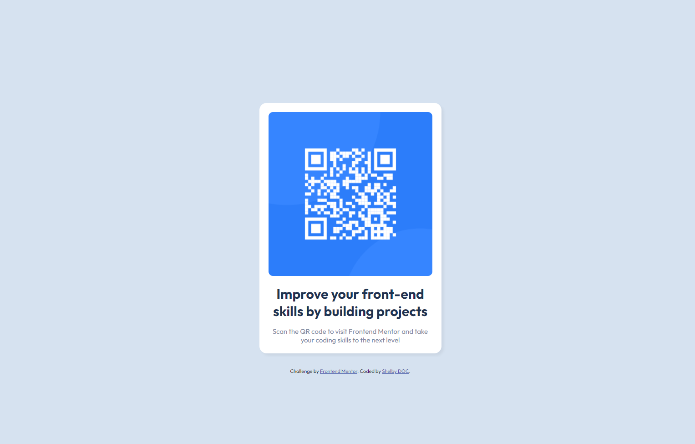

# Frontend Mentor - QR code component

This is a solution to the [QR code component challenge on Frontend Mentor](https://www.frontendmentor.io/challenges/qr-code-component-iux_sIO_H). Frontend Mentor challenges help you improve your coding skills by building realistic projects. 

## Table of contents

- [Overview](#overview)
  - [Screenshot](#screenshot)
  - [Links](#links)
- [My process](#my-process)
  - [Built with](#built-with)
- [Author](#author)

## Overview

### Screenshot

### Links

- Solution URL: [Solution URL](https://www.frontendmentor.io/solutions/qr-code-card-B1mRBZzE5)
- Live Site URL: [Live Site URL](https://shelb-doc.github.io/Qr-Code-Card/)

## My process

### Built with

- Semantic HTML5 markup
- CSS custom properties
- CSS Grid
- Mobile-first workflow

## Author

- Website - [Shelby De Oliveira Cignetti](https://shelby-doc-portfolio.netlify.app)
- Frontend Mentor - [@shelb-doc](https://www.frontendmentor.io/profile/shelb-doc)
- Twitter - [@reportturret](https://www.twitter.com/reportturret)